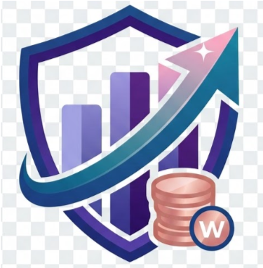

# 💎 FinanceTracker — Personal Wealth & Cash Flow Management

<p align="center">
  
</p>

<p align="center">
  <b>A state-of-the-art cross-platform Personal Finance, Budgeting & Cash Flow Management mobile & web application built with Flutter & Dart.</b>
</p>

<p align="center">
  
  
  
  
  
  
  
</p>

---

## 📖 Overview

**FinanceTracker** is a modern, high-performance personal finance tracking mobile and web application designed to help individuals and businesses track daily incomes and expenses, budget across custom categories, achieve savings goals with auto-balance deduction, carry forward net savings month-to-month, analyze 12-month annual cash flows, and export or share official financial statements in PDF and CSV formats.

---

## ✨ Key Features

### 1. 🛡️ Luxury UI & Brand Identity
- **Rich Purple Gradient Splash Screen**: Ambient glowing animations, official shield and coin logo branding, and smooth transition.
- **Adaptive Dark / Light Themes**: Sleek dark mode (`#0B0F19`) and clean light mode (`#F8FAFC`) with smooth contrast and interactive hover-lift cards.

### 2. 💎 Previous Months' Carried-Forward Balance
- **Cumulative Wealth Tracking**: Automatically carries forward all remaining net savings from previous months into the current month's available balance:
  $$\text{Total Net Balance} = \text{Previous Carried Balance} + \text{This Month's Net Savings}$$
- **Interactive Breakdown Modal**: Tapping the Net Savings card displays an itemized breakdown of past savings carried forward alongside this month's net change.

### 3. 📑 Executive PDF Statement Export & Direct Sharing
- **1-Tap Direct Sharing**: Share formatted monthly and annual PDF statements directly via **WhatsApp, Gmail, Telegram, Google Drive, Bluetooth**, and more.
- **Print & Storage Saving**: Open system print preview to save PDF statements directly to local device storage.
- **Unlimited Multi-Page Pagination**: Robust multi-page PDF generation supporting months with heavy transaction volumes (60+ records) without layout clipping.
- **CSV Data Export**: One-click spreadsheet export for Excel and Google Sheets.
- **Any-Month Selector**: Quick chips for recent months plus a full calendar picker to download historical statements for any past month or year.

### 4. 🎯 Savings Goals with Auto-Balance Deduction
- **Target-Based Funds**: Create customized savings goals (Emergency Fund, Vacation, Gadgets, etc.) with target amounts and deadlines.
- **Auto Monthly Deduction**: Depositing money into a goal automatically records a deduction transaction under the `Savings & Goals` category, adjusting the monthly available balance.
- **Visual Progress Rings**: Interactive completion percentages and days remaining countdowns.

### 5. 👥 Multi-Account Profile Switcher (FB & WhatsApp Style)
- Store and manage multiple user profiles on a single device (*Personal*, *Business*, *Family*).
- **1-Tap Fast Switching**: Seamlessly toggle between saved accounts without re-entering credentials.
- Safe persistent storage in device preferences.

### 6. 🌐 Bilingual Translation System (English 🇺🇸 & Sinhala 🇱🇰)
- Full, real-time localized UI across all screens (Navigation, Dashboard, Budgets, Goals, Reports, Dialogs).
- Instant language toggle switchers in the Top Header Bar, App Drawer, and Profile Settings.
- Persistent language preference saved in local storage.

### 7. 📊 Dynamic Interactive Dashboard
- **Monthly Overview Cards**: Real-time KPI summaries for *Monthly Income*, *Monthly Expenses*, and *Total Net Balance*.
- **Category Breakdown**: Separate interactive Doughnut Charts for Income and Expense distributions.
- **6-Month Cash Flow Trend**: Dual-rod bar chart comparing month-by-month cash flows.
- **Quick Action Triggers**: `+ Add Category` modal and `+ Add Transaction` sheet with instant updates.
- **Recent Activities Log**: Quick transaction history list with edit/delete actions.

### 8. 🎯 Monthly Budgets & Spending Limits
- Set custom monthly spending limits per category.
- Visual progress meters with real-time percentage used and over-budget alerts.
- Filter budgets by specific month and year.

---

## 🛠️ Technology Stack

| Layer | Technology |
| :--- | :--- |
| **Frontend Framework** | [Flutter](https://flutter.dev/) (v3.47+) & [Dart](https://dart.dev/) |
| **State Management** | [Provider](https://pub.dev/packages/provider) (MultiProvider Architecture) |
| **Charts & Graphs** | [fl_chart](https://pub.dev/packages/fl_chart) (Doughnut & Bar charts) |
| **PDF Generation & Sharing** | [pdf](https://pub.dev/packages/pdf) & [printing](https://pub.dev/packages/printing) |
| **Animations** | [flutter_animate](https://pub.dev/packages/flutter_animate) |
| **Storage & Caching** | [shared_preferences](https://pub.dev/packages/shared_preferences) |
| **Backend API** | PHP REST API + MySQL (with Offline Demo fallback mode) |

---

## 🚀 Getting Started & Installation

### Prerequisites
- [Flutter SDK](https://docs.flutter.dev/get-started/install) (v3.20.0 or later)
- [Dart SDK](https://dart.dev/get-dart)
- Android Studio / VS Code with Flutter Extension

### 1. Clone the Repository
```bash
git clone https://github.com/your-username/personal-finance-tracker.git
cd personal-finance-tracker_mobile
```

### 2. Install Dependencies
```bash
flutter pub get
```

### 3. Run Locally (Android / Web / Desktop)
```bash
# Run on connected Android device or emulator
flutter run

# Run on Chrome Web Browser
flutter run -d chrome
```

### 4. Build Production Release APK
```bash
flutter build apk --release
```
The generated APK will be available at:
`build/app/outputs/flutter-apk/app-release.apk`

---

## 📂 Project Structure

```
personal-finance-tracker_mobile/
├── assets/
│   └── images/               # Official logo and graphic assets
├── lib/
│   ├── core/
│   │   ├── constants/        # App colors, themes, API endpoints
│   │   ├── localization/     # Bilingual English & Sinhala dictionary (AppStrings)
│   │   ├── network/          # ApiClient & HTTP request handlers
│   │   ├── theme/            # Light & Dark theme definitions
│   │   └── utils/            # Formatters, CSV & PDF export helpers (ExportHelper)
│   ├── models/               # Transaction, Budget, Goal, Report, and User models
│   ├── providers/            # Auth, Transaction, Budget, Goal, Report, Language & Theme providers
│   ├── screens/
│   │   ├── auth/             # Login & Registration screens
│   │   ├── budgets/          # Budgets & Limits screens and dialogs
│   │   ├── dashboard/        # Dashboard overview & charts
│   │   ├── goals/            # Savings Goals screens and quick deposit sheets
│   │   ├── profile/          # Profile details, settings, and account switcher
│   │   ├── reports/          # Financial Analytics, Statements & PDF sharing
│   │   ├── splash/           # Luxury Purple Gradient Splash screen
│   │   └── transactions/     # Itemized transactions list, filters & statement exports
│   ├── widgets/              # Reusable UI cards, drawer, switcher sheets, avatars
│   └── main.dart             # Application root & MultiProvider initialization
├── web/                      # Web entrypoint, manifest, favicon & splash screen
└── pubspec.yaml              # Package dependencies and asset declarations
```

---

## 📄 License

This project is licensed under the MIT License — see the [LICENSE](LICENSE) file for details.

---

<p align="center">
  Made with ❤️ by <b>FinanceTracker Team</b>
</p>
